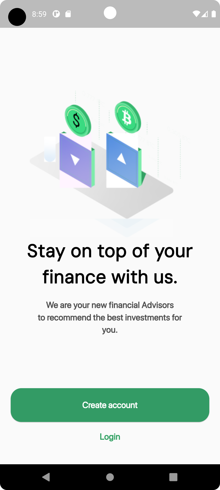
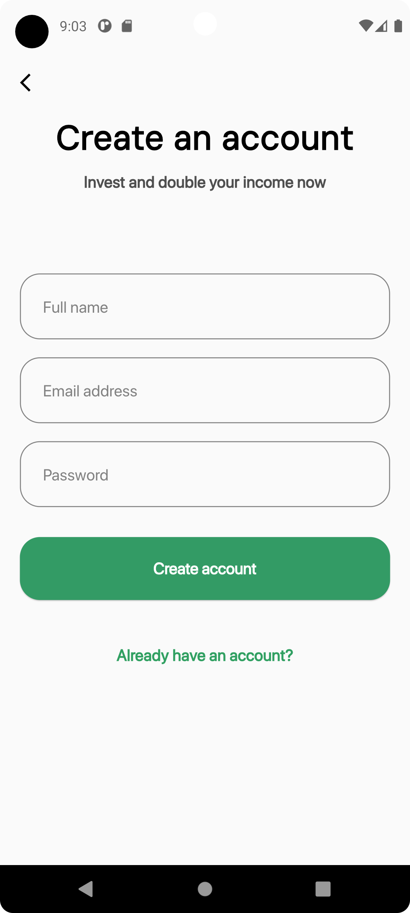
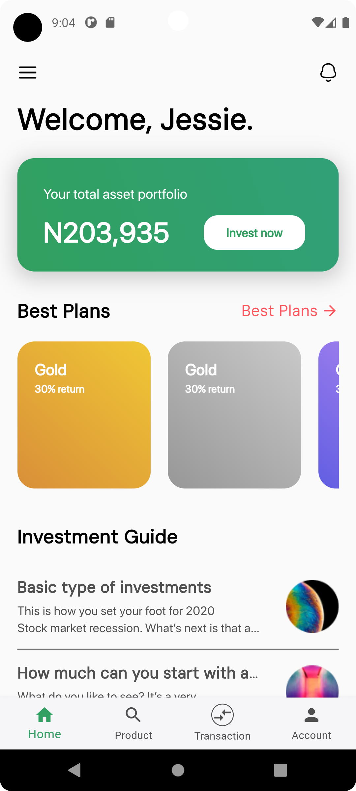

# intership_task

NAME: JESSE UGOCHUKWU OKOROAFOR

STACK: FLUTTER


# Architecture
This project uses the clean architecture approach, ensuring Separation of Concerns across codebase.
The folder structure comprises:

```
lib/
|-- app/
|   |-- modules/
|   |          |-- data/
|   |          |-- domain/
|   |          |-- presentation/
|
|
|   |-- shared/
|   |          |-- helpers/

|-- core/
|   |-- framework/
|   |-- utility/
|-- main.dart

```

# Run the application (REQUIREMENTS)

1. Android studio / Visual Studio code
2. Android Emulator / IOS Simulator


# Problems

1. Some svg's are not working (so used png for some and didn't put any svg for few)


## Screenshots
|                      Onboarding Screen                       |                      Login Screen                       |
|:------------------------------------------------------------:|:-------------------------------------------------------:|
|  |  |


|                      Home Screen                       |     |
|:------------------------------------------------------:|:---:|
|  |     |

